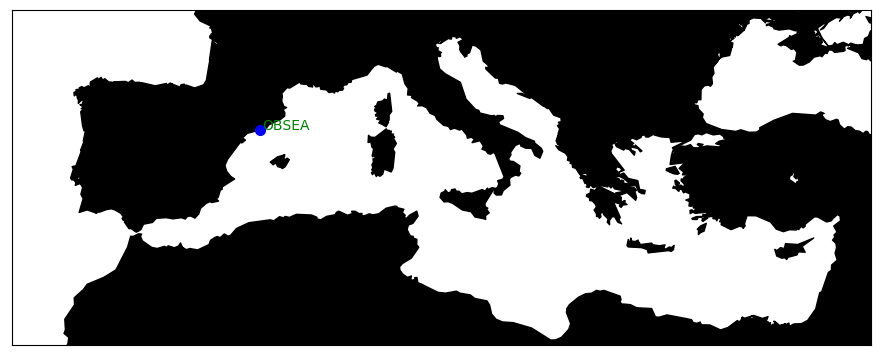

# Point on a map the position of a marine observatory

In this example, we will point on a Mediterranean map the of [OBSEA](http://www.obsea.es/). To load data and point into a map we use the WaterFrame object, the PlotMap object of the oceanobs package and the following functions:

* [WaterFrame.from_netcdf()](../api.md#WaterFrame.from_netcdf(*path*))
* [PlotMap.map_mediterranean()](../api.md#PlotMap.map_mediterranean(*res*=*'l'*))
* [PlotMap.add_point()](../api.md#PlotMap.add_point(*lon*,_*lat*,_*dot_color*=*'blue'*,_*label*=*None*,_*label_color*=*Green*))

Data comes from a netCDF file of [JERICO-NEXT](http://www.jerico-ri.eu/). JERICO is the European Research Infrastructure network for Coastal Observatory. For this example, we have to download the "last 60 days" data of the observatory called [OBSEA].

Customarily, we import as follows:

```python
import oceanobs as oc
import matplotlib.pyplot as plt
```

Now we create the WaterFrame object and load data from file path location. In our case, we have the file in the same folder of the python script.

```python
wf = oc.WaterFrame()
wf.from_netcdf("MO_LATEST_TS_MO_OBSEA_20180406.nc")
```

The file contains a lot of metadata information. For this example we are going to use "last_longitude_observation", "last_latitude_observation" and "site_code." Let's check the if the fields are in the metadata.

```python
print("Parameters:", wf.parameters())
print("Memory usage:", wf.memory_usage()/10**6, "MBytes")
```

Output:

```bash
data_type OceanSITES time-series data
format_version 1.2
...
site_code OBSEA
...
last_latitude_observation 41.182
last_longitude_observation 1.75235
last_date_observation 2018-04-06T23:00:00Z
```

Now, we are going to create the Plot Map object, and then we load a map of the Mediterranean Sea.

```python
pm = oc.PlotMap()
pm.map_mediterranean()
```

Finally, we add the position on the map. Results are in Figure 1.

```python
pm.add_point(lon=wf.metadata["last_longitude_observation"],
             lat=wf.metadata["last_latitude_observation"],
             label=wf.metadata["site_code"])
plt.show()
```

Output:



Figure 1: Position of OBSEA on the Mediterranean Sea

The complete code:

```python
import oceanobs as oc
import matplotlib.pyplot as plt

wf = oc.WaterFrame()
wf.from_netcdf("MO_LATEST_TS_MO_OBSEA_20180406.nc")

for key in wf.metadata:
    print(key, wf.metadata[key])

pm = oc.PlotMap()
pm.map_mediterranean()
pm.add_point(lon=wf.metadata["last_longitude_observation"],
             lat=wf.metadata["last_latitude_observation"],
             label=wf.metadata["site_code"])
plt.show()
```
