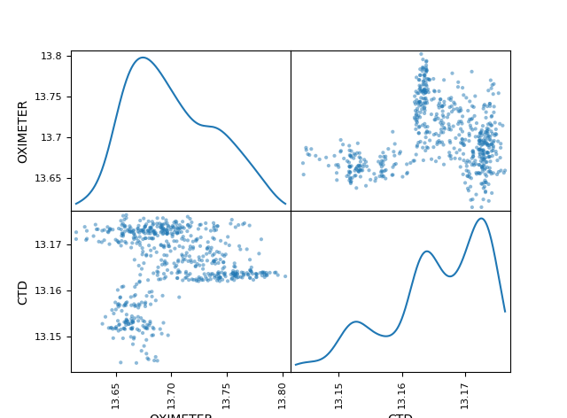
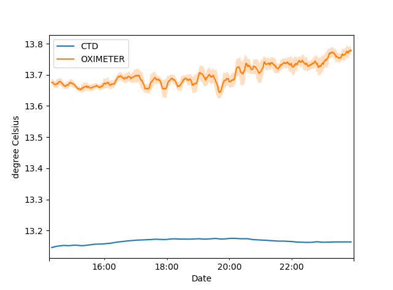

# Compare sea water temperature measurements of two sensors in the same marine observatory

An [EMSO](http://emso.eu/) Generic Module ([EGIM](http://www.emsodev.eu/)) contains several instruments to characterize some physical properties of water. In this example, we will check if two of the devices that measure water temperature register the same values. To do this, we will download temperature data from a CTD and an Oximeter installed in the EGIM, and later, we will correlate them to obtain our conclusions. To download and analyze the data we will use the WaterFrame object and the EGIM object of the oceanobs package and the following functions:

* [EGIM.observatories()](../api.md#EGIM.observatories())
* [EGIM.instruments()](../api.md#EGIM.instruments(*observatory*))
* [EGIM.parameters()](../api.md#EGIM.parameters(*observatory*,_*instrument*))
* [EGIM.metadata()](../api.md#EGIM.metadata(*observatory*,_*instrument*))
* [EGIM.observation()](../api.md#EGIM.observation(*observatory*,_*instrument*,_*parameter*,_*startDate*=*None*,_*endDate*=*None*,_*limit*=*None*))
* [EGIM.to_waterframe()](../api.md#EGIM.to_waterframe(*data*,_*metadata*))
* [WaterFrame.parameters()](../api.md#WaterFrame.parameters())
* [WaterFrame.rename()](../api.md#WaterFrame.rename(*old_name*,_*new_name*))
* [WaterFrame.resample()](../api.md#WaterFrame.resample(*rule*,_*method*=*'mean'*))
* [WaterFrame.concat()](../api.md#WaterFrame.concat(*waterframe*))
* [WaterFrame.scatter_matrix()](../api.md#WaterFrame.scatter_matrix(*keys*,_*ax*=*None*))
* [WaterFrame.tsplot()](../api.md#WaterFrame.tsplot(*keys*,_*rolling*=*None*,_*ax*=*None*,_*average_time*=*None*,_*secondary_y*=*False*))
* [WaterFrame.to_pickle()](../api.md#WaterFrame.to_pickle(*path*))

Customarily, we import as follows:

```python
from oceanobs.access import EGIM
import matplotlib.pylab as plt
```

Now we are going to create the EGIM object with which we will download the data that we need. The EMSO Data Management Platform (DMP) is still under development, so we need a user and a password to download data.

```python
login = "YOUR LOGIN"
password = "YOUR PASSWORD"
egim = EGIM(login, password)
```

First, we will ask for information on how many observatories are currently available in the DMP.

```python
code, observatories = egim.observatories()
if code == 200:
    for i, observatory in enumerate(observatories):
        print(i, observatory)
else:
    print("Error code:", code)
```

Output:

```bash
0 EMSODEV-EGIM-node00001
```

At the moment there is only one observatory called EMSODEV-EGIM-node00001 so we will keep your name in the variable "observatory."

```python
observatory = observatories[0]
```

Next, we will ask for information about what instruments are in the selected observatory.

```python
code, instruments = egim.instruments(observatory)
if code == 200:
    for i, instrument in enumerate(instruments):
        print(i, instrument['sensorLongName'])
else:
    print("Error code:", code)
```

Output:

```bash
0 Ifremer G390401
1 SBE37-SIP-P7000-RS232
2 AADI-3005214831 DW4831
3 WETlabs ECO NTUrtd
4 SBE54 Tsunami meter
5 TELEDYNE RDI Workhorse monitor
6 OceanSonics icListen SB60L-ETH
```

We are going to keep the names of the CTD (SBE37-SIP-P7000-RS232) and the oximeter (AADI-3005214831 DW4831).

```python
instrument_ctd = instruments[1]['name']
instrument_oximeter = instruments[2]['name']
```

Then we will ask for information about the parameters that the CTD can measure.

```python
code, parameters = egim.parameters(observatory, instrument_ctd)
if code == 200:
    for i, parameter in enumerate(parameters):
        print(i, parameter['name'])
else:
    print("Error code:", code)
```

Output:

```bash
0 salinity
1 depth
2 conductivity
3 sea_water_temperature
4 sound_velocity
```

Since we want to compare water temperatures, we will keep the name "sea_water_temperature." The oximeter also measures the water temperature. If you want to check it, you just need to replace "egim.parameters (observatory, instrument_ctd)" with "egim.parameters (observatory, instrument_oximeter)" from the previous code.

```python
parameter = parameters[3]['name']
```

Now we are going to ask for information about the metadata of the CTD, and we will keep the answer in the "metadata" variable.

```python
code, metadata = egim.metadata(observatory, instrument_ctd)
if code == 200:
    for key in metadata:
        print(key, metadata[key])
else:
    print("Error code:", code)
```

Output:

```bash
EGIMLocation OBSEA_test_site
EGIMNodeURL http://www.upc.edu/cdsarti/OBSEA/SWE/files/EGIM_status.xml
SOSOfferingID SBE37_data
SOSProcedureID 37-14998
SpatialSamplingPointID sbe37_data
SpatialSamplingPointName SBE37
EGIMPosition 41.1819,1.7527
EGIMPositionSRSName http://www.opengis.net/def/crs/EPSG/0/4326
OMResultType measurement
EGIMNode EMSODEV:EGIM:node00001
OMObservationType http://www.opengis.net/def/observationType/OGC-OM/2.0/OM_ComplexObservation
SpatialSamplingPointIdentifier SBE37_data
OMSpatialSamplingPointNameType http://www.opengis.net/def/samplingFeatureType/OGC-OM/2.0/SF_SamplingPoint
                     sea_water_temperature
```

Now we will request for the data or observations. For this example, we will download data generated between 01/02/2017 and 02/02/2017. The data will be saved in the "observation" variable.

```python
code, observation = egim.observation(observatory, instrument_ctd, parameter,
                                     startDate="01/02/2017",
                                     endDate="02/02/2017")
if code == 200:
    print(observation.head())
else:
    print("Error code:", code)
```

Output:

```bash
                     sea_water_temperature
TIME
2017-02-01 14:10:34                13.1436
2017-02-01 14:10:44                13.1437
2017-02-01 14:10:54                13.1434
2017-02-01 14:11:04                13.1433
2017-02-01 14:11:14                13.1430
```

Now we will create a WaterFrame object from the downloaded data and metadata.

```python
wf = egim.to_waterframe(observation, metadata)
print(wf.parameters())
```

Output:

```bash
['TEMP']
```

Now we are also going to request data and metadata from the oximeter. As before, we will then create a WaterFrame object.

```python
code, observation = egim.observation(observatory, instrument_oximeter,
                                     parameter, startDate="01/02/2017",
                                     endDate="02/02/2017")
if code == 200:
    print(observation.head())
else:
    print("Error code:", code)
```

Output:

```bash
                     sea_water_temperature
TIME
2017-02-01 14:14:06                 13.611
2017-02-01 14:14:07                 13.635
2017-02-01 14:14:08                 13.647
2017-02-01 14:14:09                 13.657
2017-02-01 14:14:10                 13.622
```

```python
code, metadata = egim.metadata(observatory, instrument_ctd)
if code == 200:
    for key in metadata:
        print(key, metadata[key])
else:
    print("Error code:", code)
```

Output:

```bash
EGIMLocation OBSEA_test_site
EGIMNodeURL http://www.upc.edu/cdsarti/OBSEA/SWE/files/EGIM_status.xml
SOSOfferingID SBE37_data
SOSProcedureID 37-14998
SpatialSamplingPointID sbe37_data
SpatialSamplingPointName SBE37
EGIMPosition 41.1819,1.7527
EGIMPositionSRSName http://www.opengis.net/def/crs/EPSG/0/4326
OMResultType measurement
EGIMNode EMSODEV:EGIM:node00001
OMObservationType http://www.opengis.net/def/observationType/OGC-OM/2.0/OM_ComplexObservation
SpatialSamplingPointIdentifier SBE37_data
OMSpatialSamplingPointNameType http://www.opengis.net/def/samplingFeatureType/OGC-OM/2.0/SF_SamplingPoint
```

```python
wf_oximeter = egim.to_waterframe(observation, metadata)
print(wf_oximeter.parameters())
```

Output:

```bash
['TEMP']
```

Now we are going to rename the parameter "TEMP" of each WaterFrame to the name of the instrument from which it comes so that it is easier to identify them.

```python
wf.rename(old_name="TEMP", new_name="CTD")
wf_oximeter.rename(old_name="TEMP", new_name="OXIMETER")
```

We will contact the two Water Frame in one.

```python
wf.concat(wf_oximeter)
print(wf.parameters())
```

Output:

```bash
['CTD', 'OXIMETER']
```

The CTD and the Oximeter have different sampling frequencies, so we have different amounts of values in the time series of each instrument. To fix this small inconvenience, we will resample the time series to one measure every minute. We will save the average of the values obtained every minute.

```python
wf.resample(rule="T")
```

Finally, we compare the measurements drawing a matrix of scatter plots with a histogram plot in the diagonal. Figure 1 shows the result. The two time series of temperature do not seem very correlated ... What can happen?

```python
wf.scatter_matrix(["CTD", "OXIMETER"])
plt.show()
```

Output:


*Figure 1: Scatter matrix graph*

We have downloaded data from a developing platform. In this case, some sensor is still decalibrated. Figure 2 shows that there is a considerable difference between the measurements of the two instruments. Besides, the Oximeter measures are much noisier than those of the CTD.

```python
wf.tsplot(["CTD", "OXIMETER"])
plt.show()
```


*Figure 2: Time series of seawater temperature of the CTD and the Oximeter*

This is optional, but we can save the WaterFrame object as a pickle file.

```python
wf.to_pickle("egim_temps.pkl")
```

The complete code:

```python
from oceanobs.access import EGIM
import matplotlib.pylab as plt

login = "YOUR LOGIN"
password = "YOUR PASSWORD"
egim = EGIM(login, password)


code, observatories = egim.observatories()
if code == 200:
    for i, observatory in enumerate(observatories):
        print(i, observatory)
else:
    print("Error code:", code)
observatory = observatories[0]


code, instruments = egim.instruments(observatory)
if code == 200:
    for i, instrument in enumerate(instruments):
        print(i, instrument['sensorLongName'])
else:
    print("Error code:", code)
instrument_ctd = instruments[1]['name']
instrument_oximeter = instruments[2]['name']

code, parameters = egim.parameters(observatory, instrument_ctd)
if code == 200:
    for i, parameter in enumerate(parameters):
        print(i, parameter['name'])
else:
    print("Error code:", code)
parameter = parameters[3]['name']

code, metadata = egim.metadata(observatory, instrument_ctd)
if code == 200:
    for key in metadata:
        print(key, metadata[key])
else:
    print("Error code:", code)

code, observation = egim.observation(observatory, instrument_ctd, parameter,
                                     startDate="01/02/2017",
                                     endDate="02/02/2017")
if code == 200:
    print(observation.head())
else:
    print("Error code:", code)

wf = egim.to_waterframe(observation, metadata)

code, observation = egim.observation(observatory, instrument_oximeter,
                                     parameter, startDate="01/02/2017",
                                     endDate="02/02/2017")
if code == 200:
    print(observation.head())
else:
    print("Error code:", code)

code, metadata = egim.metadata(observatory, instrument_ctd)
if code == 200:
    for key in metadata:
        print(key, metadata[key])
else:
    print("Error code:", code)

wf_oximeter = egim.to_waterframe(observation, metadata)

wf.rename(old_name="TEMP", new_name="CTD")
wf_oximeter.rename(old_name="TEMP", new_name="OXIMETER")

wf.concat(wf_oximeter)
print(wf.parameters())

wf.resample(rule="T")

wf.tsplot(["CTD", "OXIMETER"])
plt.show()

wf.scatter_matrix(["CTD", "OXIMETER"])
plt.show()

wf.to_pickle("egim_temps.pkl")
```